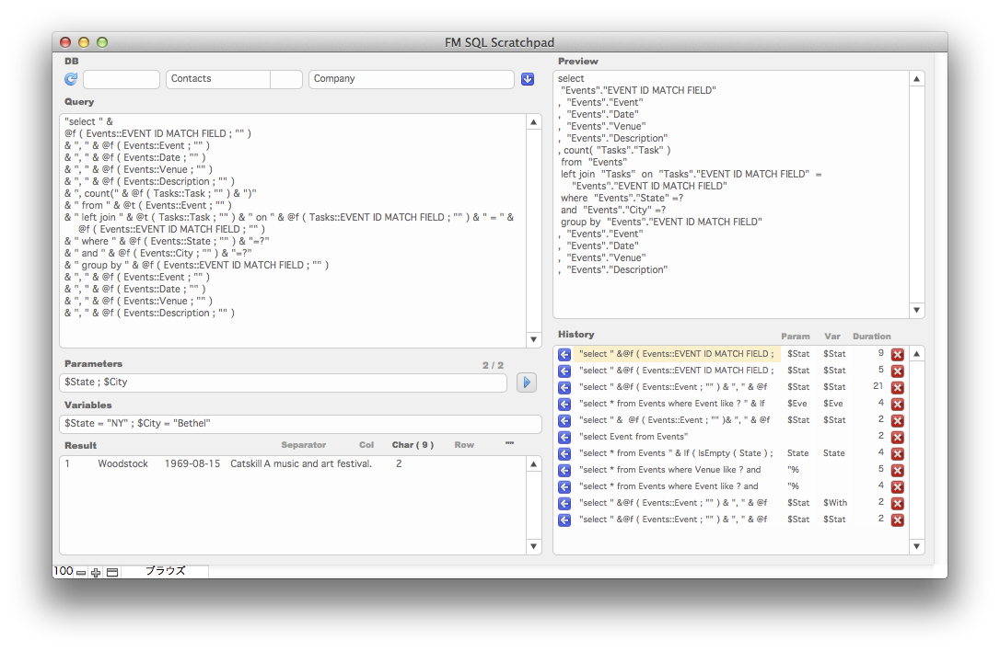

FM SQL Scratchpad
===============

FM SQL Scratchpad is an effort to improve productivity when writing FileMaker's ExecuteSQL function.



## Features

- __Dialog free__ : Write/Run a query and see the result without opening/closing dialogs.
- __Query history__ : A succeeded query is automatically recorded with its parameters.
- __Table/Field reference abstraction__ : Two built-in custom functions to use field references in a query rather than embedding table/field names as string literals.
- __Auto-complete field reference__ : To reduce typing and typos, field reference in the custom functions can be auto-completed.
- __Keyboard shortcuts__ : Some editor-like keybord shortcuts to reduce typing and mouse operations.
- __Customizable__ : It is just a FileMaker database file (.fmp12).

## Requirements

- __FileMaker Pro 12__ : Advanced version is required to add the custom functions to your solutions.
- __2empowerFM Text Toolkit plugin__ : A free FileMaker plugin by [Draconventions](http://www.dracoventions.com/). It is used only by FM SQL Scratchpad which means it is not required on production environments. It can be downloaded from [Draconventions product page](http://www.dracoventions.com/products/2empowerFM/family/regex.php)

## Download

.zip archive can be downloaded from https://bintray.com/harawata/fm/fmsqlscratchpad

## Setup

_If you just want to see how it works, please skip to the next 'Quick start' section which uses the sample database  for the explanation._  

To use FM SQL Scratchpad with your own solution, you need to follow these steps.

1. Open Database Management dialog and add occurrences of the target tables.
1. Close Database Management dialog and press __Reload Field List__ button (__cmd + 5__).

Note: On Windows, use _ctrl_ and _alt_ instead of _cmd_ and _opt_ respectively.

## Quick Start

To explain basics, the archive of FM SQL Scratchpad includes an example solution _Event Management_ which is one of the [Starter Solutions](http://www.filemaker.com/solutions/starter_solutions.html).  

1. Let's write a simple query. Note that the double quotes ```"``` are required.  
  - Query : ```"select Event, Venue from Events"```
1. Press __cmd + 2__ to run the query. The result will be displayed in the __Result__ field.
1. Let's add a dynamic query parameter.  
  - Query : ```"select Event, Venue from Events where State = ?"```
  - Parameters : ```"NY"```
1. So far, so good, but you wouldn't use the static parameter value ```"NY"``` in the actual function. Let's make it a variable.
  - Query : ```"select Event, Venue from Events where State = ?"```
  - Parameters : ```$State```
  - Variables : ```$State = "NY"```
1. To copy the query as a form of __ExecuteSQL__ function, press __shift + cmd + c__.


## Advanced Usage

1. Separate multiple parameters and variables with semicolon ```;```.
  - Query : ```"select * from Events where Event like ? " & If ( IsEmpty ( $State ) ; "" ; " and State = ? " )```
  - Parameters : ```$EventName ;  $State```
  - Variables : ```$EventName = "Woodstock" ; $State = "NY"```
1. It's even possible to use variables without a dollar sign ```$```, assuming that the __ExecuteSQL__ is used inside __Let__ function.
  - Query : ```"select * from Events " & If ( IsEmpty ( State ) ; "" ; " where State = ? " )```
  - Parameters : ```State```
  - Variables : ```State = "NY"```

## Custom functions

There are two very simple built-in custom functions that can be used to abstract table/field references in a query.  
You can build/run a query in SQL Scratchpad without using these functions, but it is a good practice to abstract table/fields references in your solution in case you want to rename them in the future.

### @t ( Field ; TableAlias )

Outputs table name with double quotes.  
When _TableAlias_ is empty, it does not output an alias.  
```@t ( Events::Event ; "" ) -> "Events"```  
When _TableAlias_ is specified, it outputs the alias after the actual table name.  
```@t ( Events::Event ; "evt" ) -> "Events" "evt"```  
Only the table occurrence name is used in this function, so you can specify any field in the table.  
```@t ( Events::Venue ; "evt" ) -> "Events" "evt"```

### @f ( Field ; TableAlias )

Outputs field name with double quotes.  
When _TableAlias_ is empty, the actual table occurrence name is output.  
```@f ( Events::Venue ; "" ) -> "Events"."Venue"```  
When _TableAlias_ is specified, it is used as the prefix.  
```@f ( Events::Venue ; "evt" ) -> "evt"."Venue"```

### Example

With these custom functions, the example query in the quick start section can be written as follows.  

```
"select " &  @f ( Events::Event ; "" )
& ", " & @f ( Events::Venue ; "" )
& " from " & @t ( Events::Event ; "" )
& " where " & @f ( Events::State ; "" ) & "=?"
```  

## Content Assist

### Auto-completion

Auto-completion works in @f() and @t() custom functions, place the cursor between ```@f (``` and ```;``` then type the first few characters of the table/field name and press __cmd + 3__.  

- If there is only one candidate, it's automatically auto-completed.
- If there are multiple candidates, the cursor is moved to the Table/Field list. Press __cmd + 4__ after choosing the right table/field.

See the examples below.

### Keyboard Shortcuts

On Windows, use _ctrl_ and _alt_ instead of _cmd_ and _opt_ respectively.

- __cmd + opt + p__ : Insert line below current line.
- __cmd + opt + v__ : Insert @f() custom function.
- __cmd + opt + t__ : Insert @t() custom function.
- __cmd + opt + d__ : Delete current line(s).
- __cmd + opt + ↑__ : Move lines (up).
- __cmd + opt + ↓__ : Move lines (down).
- __shift + cmd + opt + ↑__ : Duplicate lines (up).
- __shift + cmd + opt + ↓__ : Duplicate lines (down).
- You might find more in Edit, Insert or Scripts menu.

### Examples

Here are a few example usage of content assist.  
It assumes that the example _Event Management_ solution exists.

- Single candidate :
  1. Press __cmd + opt + v__ -> ```@f (  ; "" )``` is inserted.
  1. Type ```e```
  1. Press __cmd + 3__ -> ```@f ( Events:: ; "" )```
  1. Type ```ci```
  1. Press __cmd + 3__ -> ```@f ( Events::City ; "" )```
- Multiple candidates :
  1. Press __cmd + opt + v__ -> ```@f (  ; "" )``` is inserted.
  1. Type ```c```
  1. Press __cmd + 3__ -> Cursor is moved to Table Name field.
  1. Type the next character ```o``` and choose _Contacts_
  1. Press __Tab__ key twice to move the cursor to Field Name field.
  1. Choose _Company_ from the list.
  1. Press __cmd + 4__ -> ```@f ( Contacts::Company ; "" )```

## Debugging Tips

Thanks to [this custom function](http://www.fmfunctions.com/fid/335), it's possible to see the internal error message when a query fails.
Just add the following expression to the Data Viewer.  
```Evaluate ( "sql.debug ( " & $$_SQL_ExecuteSQL_Str & " )" )```  
You should remove it from the watch list when finished debugging because Data Viewer re-evaluates the expression frequently.

## License

- FM SQL Scratchpad is licensed under [MIT License](http://www.opensource.org/licenses/mit-license.php).
- Icons created by [Yusuke Kamiyamane](http://p.yusukekamiyamane.com/) are licensed under a [Creative Commons Attribution 3.0 License](http://creativecommons.org/licenses/by/3.0/deed.ja).

## FAQ

- Can I use comment?
  - Yes, if you use ```/* ... */``` format. ```// ...``` won't work.
- How can I specify a repetition number?
  - ```@f ( table_a::field_1 ; "" ) & "[30]"``` or ```@f ( table::field_1 ; "" ) & "[" & $RepNum & "]"``` with a variable. SQL placeholder ```?``` does not work in the bracket.
